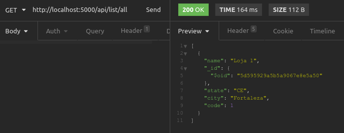
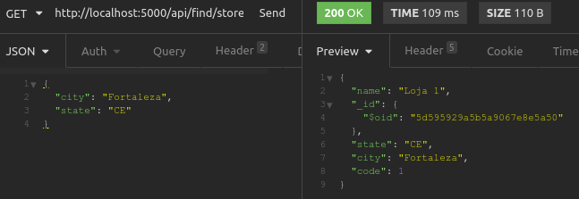

# API Flask, React, Mongo DB

CRUD utilizando Flask para API Backend, e algumas de suas ferramentas

- Flask
- flask_cors
- pymongo
- bson

## Como executar o projeto

Vamos executar os comandos abaixo partindo que esteja no diretório raiz onde fez o clone do projeto.

```sh
cd backend
export FLASK_APP=app
export FLASK_ENV=Development
export FLASK_DEBUG=True

flask run
```

Acesse o projeto através do endereço:
```sh
http://localhost:5000
```

## CRUD

### Inserir Items

Para criar uma entrada no banco iremos utilizar o path abaixo em algum aplicativo como Postman ou Insomnia

```sh
http://localhost:5000/api/add/store
```

Via metódo POST, passaremos o corpo do objeto json a ser inserido
```json
{
	"code":"1",
	"name":"Loja 1",
	"city": "Fortaleza",
	"state": "CE"
}
```

Exemplo:


### Listar Items

**1. Listar todos**

Para listar todos os itens acessamos via metodo GET o endereço abaixo:

```sh
http://localhost:5000/api/list/all
```

Resultado:

```json
[
  {
    "name": "Loja 1",
    "_id": {
      "$oid": "5d595929a5b5a9067e8e5a50"
    },
    "state": "CE",
    "city": "Fortaleza",
    "code": 1
  }
]
```

Exemplo:



**2. Listar por filtro de localidade**

Para listar todos os itens utilizando filtro acessamos o endereço abaixo:

```sh
http://localhost:5000/api/find/store
```

Via metódo GET, passaremos o corpo do objeto json a ser inserido
```json
{
	"city": "Fortaleza",
	"state": "CE"
}
```
Resultado:
```json
{
  "name": "Loja 1",
  "_id": {
    "$oid": "5d595929a5b5a9067e8e5a50"
  },
  "state": "CE",
  "city": "Fortaleza",
  "code": 1
}
```

Exemplo:



**3. Listar por _id**

Para listar um item por _id acessamos o endereço abaixo:

Via metódo GET, passaremos o _id via URL
```sh
http://localhost:5000/api/list/<id>
```
Resultado:

```json
{
  "name": "Loja 1",
  "_id": {
    "$oid": "5d595929a5b5a9067e8e5a50"
  },
  "state": "CE",
  "city": "Fortaleza",
  "code": 1
}
```

Exemplo:


### Atualizar Item

Para atualizar um item acessamos o endereço abaixo:

Via metódo PUT, passaremos o _id via URL
```sh
http://localhost:5000/api/update/store/<id>
```

Via metódo PUT, passaremos o corpo do objeto json a ser atualizado
```json
{
	"code":"1",
	"name":"Loja Atualizada",
	"city": "Fortaleza",
	"state": "CE"
}
```

Resultado:

```json
{
  "city": "Fortaleza",
  "code": 1,
  "name": "Loja Atualizada",
  "state": "CE"
}
```

Exemplo:


### Deletar Items

Para deletar um item acessamos o endereço abaixo:

Via metódo DELETE, passaremos o _id via URL
```sh
http://localhost:5000/api/delete/store/<id>
```
Resultado:

```json
{
  "message": "successful delete item _id:5d595929a5b5a9067e8e5a50"
}
``` 

Exemplo:


# Verificado Tempo de Digitação

Para executar o script Python para verificar a velocidade de digitação executamos o comando abaixo na raiz do projeto clonado.

```sh
python time-press-keyboard.py

OR

python3 time-press-keyboard.py
```